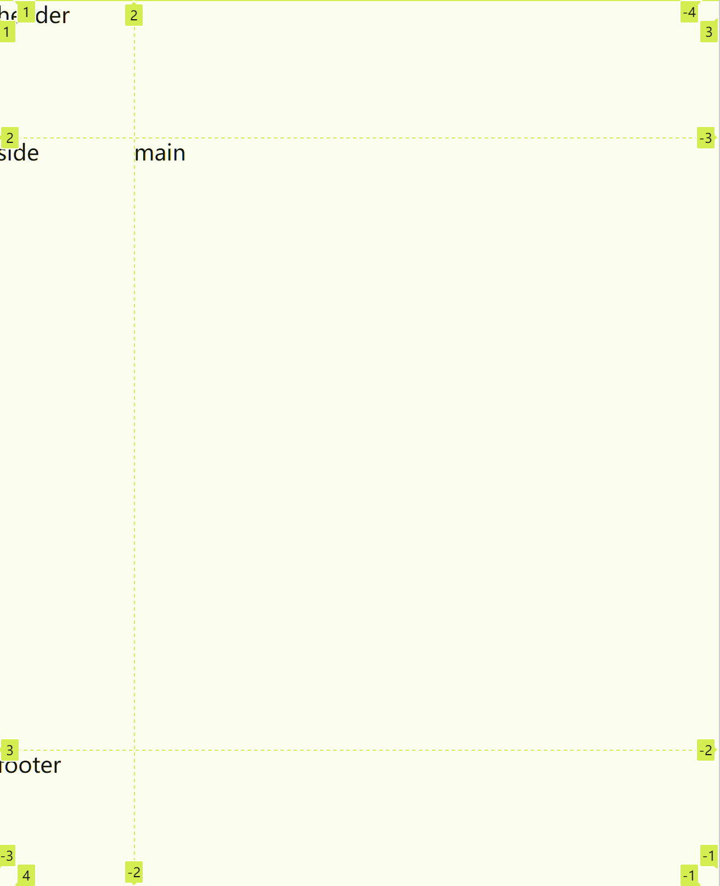

# 使用 grid 实现网页的框架布局



## 概述

grid布局可以更灵活的在父级控制元素的布局位置，从而避免了一维布局如flex的过度嵌套的问题。

## TODO

- [ ] 和flex对比

## 实现

```css
.grid1 {
  width: 100%;
  height: 100%;
  display: grid;
  grid-template-columns: 100px 1fr;
  grid-template-rows: 100px 1fr 100px;
}

.header {
  grid-column-start: 1;
  grid-column-end: 3;
  grid-row-start: 1;
  grid-row-end: 2;
}

.footer {
  grid-column-start: 1;
  grid-column-end: 3;
  grid-row-start: 3;
  grid-row-end: 4;
}
```

解释： 

- grid-template-columns: 100px 1fr;：设定列布局 
  - 1fr：比例扩展
- grid-column-start: 1;：子元素进行单元格占位

## 总结

grid的二维布局非常方便有效，解决了嵌套的问题。

## Reference

1. [最强大的 CSS 布局 —— Grid 布局 - 掘金](https://juejin.cn/post/6854573220306255880)